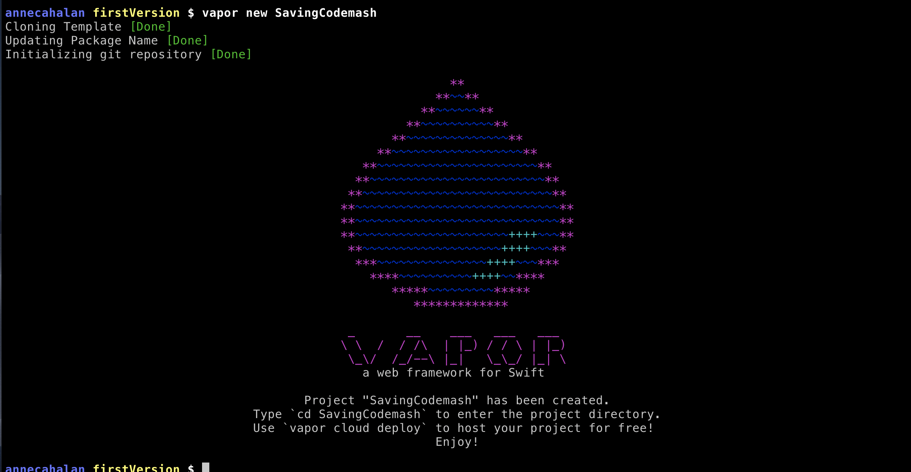

# Server Side Swift 
# [fit] Saves 
# [fit] CodeMash

--- 

# PreReqs 
* Swift >= 4.2
* Xcode >= 10
* Homebrew
* RESTed* 
* Docker 
* https://bit.ly/2N2qyjG 
* \#precompiler-server-side-swift

^ Here's the pre reqs! I hope you have all of these things, but if you don't I'll leave this up for a few so you can git on that. 

--- 

# Hi 👋🏻

^ I'm Anne, I'm an iOS developer at a company called TeamSnap, where we help take the work out of play. According to our marketing department. And I proposed this precompiler because I wanted to learn more about Server Side Swift myself, and the best way for me to learn is to impose a deadline on myself where I have to explain it someone else.  

---

# Agenda 
- What is Server Side Swift and why do I want one 
- Let's build a back end 
- Break
- Let's build a front end 
- Let's go to the lazy river 

^ So here's my plan for the afternoon. We're going to go over what exactly sss is, a little background on Vapor, the framework we'll be using, then we're going to dive and build ourselves a back end. We'll take a quick break and the build a front end--a website that uses our shiny new Vapor back end. Then, we'll all high five and head for the waterpark. Sound good? (Give the law of two feet disclaimer and story about Abstractions)
	
---

# What is Server Side Swift? 

^ Simply, it's what it says it is: using swift on the server side of an application. It's a set of frameworks and paradigms for moving your data from the database to the front end. I had to explain to my 10 year old niece yesterday what this workshop was about, and the way I described it to her was: the back end works with your database to package the informationi in a usable way, then hands the data to the front end, which takes that data and displays it. I annoyed some guy on an iOS dev slack the other day by saying that our jobs were mostly just converting JSON to pixels, but in that metaphor, server side swift is, essentially, using swift to package your data and send it to whatever your front end is going to be. 

---

# Thats...neat

^ It is! For a bunch of reasons! SSS definitely started as a "let's see if we can do this" project about four years ago, around the time swift was open sourced. But it's proven to have some great advantages. For one thing, benchmark tests show that swift is SUPER POWERFUL and much faster compared to something like Node.js. There's a try!Swift talk by Chris Bailey from IBM from a couple years ago that references some benchmark testing they did, and swift was very slightly faster than Java, four times faster than Node, and, this is cool, used half as much memory as Java while speeding along. 

^ Also, if you are building mac or iOS applications, it allows you to use the same language and the same skill set--and maybe the same developers?-- end to end. I've essentially been a Swift developer for the entire useful part of my career, as a junior I was working in ObjectiveC, but mostly I've been in swift. And, as an iOS developer, a lot of what you do is take an API that someone else, some client made, and turn it into an app. JSON into pixels. And I always was frustrated that that API was a black box. You get what you get and you don't throw a fit, which is something else I had to explain to my niece yesterday when we walked by the candy hut. I was interested in SSS myself as a way to ... unlock that box a little. To figure out what goes into making an API, what challenges and compromises you encounter, that sort of thing. 

^ Like I said, SSS started out as an experiment, but it's grown into an entire development ecosystem, there's multiple frameworks, a conference on SSS that runs in Copenhagen every year, there's a SSS work group within the Swift Workgroup that oversees technical direction and standard setting for library and tool proprosals. 

--- 

# 💧 Vapor 

^ In this workshop, we're going to be using a platform called Vapor, which until recently was one of the two big players in the SSS world, the other being an IBM-backed framework called Kitura, but-- 
 
 ---
 
# [fit] BREAKING NEWS

^ In early December, IBM announced that it had reviewed its open source priorities and was suspending support of Kitura. The two IBM devs, which include our buddy Chris Bailey of those benchmarking stats, were being reassigned to other projects and thus resigned their posts on the Server Side Swift work group. While Kitura is open source and theoretically others could continue with other support, we'll see if that actually happens. There are a few other frameworks, one called Perfect has been around for a while, this basically leaves Vapor as the main focus of development right now. So I chose wisely. 

---

# 💧 Vapor 

^ But back to Vapor for a moment. Vapor's an open source framework, itself written entirely in Swift, that can be used to create RESTful APIs and webapps. It includes an Object Relational Mapping tool called Fluent that helps you communicate with a database, a templating language for creating web pages, and a few other packages for things like authentication and authorization. It was released originally in late 2015 after Apple open-sourced swift, then got serious when the team rewrote Vapor 3 based on SwiftNIO, Apple's networking framework. 
 
 ---

# Let's build a back end
- Start a project
- Create a route
- Set up a database
- CRUD
- Intro to Controllers 

^ Enough cribbing from wikipedia articles, let's get to actual work. Here's what we're going to do: we're going to set up a project, walk through real basic route creation, then set up our database and build out a model with full CRUD routes, then get introduced to Controllers, a convenience Vapor provides for keeping your code tidy and discreet. 

^ Some disclaimers: this isn't an intro session, exactly. It's going to assume that you can follow along with things like terminal commands, using Xcode and/or another text editor, basic swift syntax. I'll be happy to explain things if you have questions at any level, but this session is timed for us to be moving at a pace that doesn't allow for a lot of intro work. That said, if you just press all the same buttons we're pressing, you should be able to make the thing to do the thing. I found it valuable when I was very junior to immerse myself in water that was over my head. I didn't always understand what I was doing, but I feel like it set hooks that later knowledge was able to anchor to do, and helped me discover what I wanted to learn next. 

--- 


# Let's get coding

--- 

```
> brew tap vapor/tap
> brew install vapor/tap/vapor
```

^ open your terminal, CD into whatever project folder you want to do this in.
* `brew tap vapor/tap` 
* `brew install vapor/tap/vapor` 
* Homebrew, if you aren't famiiar with it, is software package manager that makes installing software on macOS easier.l 
* What we're installing now is the vapor toolbox, which is command line interface that makes working with vapor a little more streamlined. 
* Make and CD into a directory 

--- 

```
> mkdir Vapor && cd $_
> vapor new SavingCodeMash
```

^ We're going to use this vapor toolbox to generate our project, so type `vapor new SavingCodemash` 

---



^ You should see this screen 

--- 

```
> cd SavingCodeMash
> vapor build 
> vapor run
> open .
```

^ And you should be able to navigate into the SavingCodemash directory and run these two commands:
* The first time you build, it will take a few minutes to fetch the dependencies and build the initial project 
* Run starts a server at localhost 8080, so let's head over there and see what we've got 
* It's aaaliiiiiveee!!! 
* And this is very exciting, but let's look at what we actually have here. 
* CTRL-C stops the server, pops us back into the terminal 
* Go ahead and `open .` and take a look at our file structure
* So this is cool, we have some yaml, a dockerfile, some sources, if you drill into sources you've got something app.swift...anyone notice anything interesting? 

--- 

# 🤯🤯🤯
#No Xcode Project?
# 🤯🤯🤯


^ * There's NO XCODE PROJECT :mindblown: :mindblown: :mindblown:
* Yeah, so about that. Vapor runs on swift package manager, which is a dependency manager similar to Cocoapods
* SPM is worthy of its own entire workshop, so I'm really just going to skim the surface. For our purposes, you need to know that Xcode projects are basically discardable when using SPM because they are regenerated whenever something changes. 
* Drilling into `Sources`, there's an App and a Run directory. Run contains only main.swift, which you won't need to mess with in this workshop, it's the entry point for every app. The App directory is what holds all our code and will be our home for the next couple hours. 

---


# Code time

^ I'm gonna hop out of Deckset right now and start doing some live-ish coding with you. Hold please while I shuffle screens. 

---


---

# Let's build a front end 
- Intro to Leaf 
- Make it less ugly 
- All the CRUD, but pretty 

---


# Press some buttons

---

# Next steps 
* Authentication?
* Deploy to Vapor Cloud?
* Codemash API?  
* ...mac/iOS app?


^ So, that was fun! But we've reached the end of our time here. If you want to build onto this and keep going with it, here's a couple things you could add. Authentication, for example, so you can log in and log out, maybe restrict access to things like editing and deletion to logged in users? Vapor has a cloud hosting service called Vapor Cloud--you could deploy this to the world. I think the next thing I want to do, is to connect to the codemash api, and be able to select sessions and create notes with some of the codemash data integrated in. My original plan for this precompiler was twice as long and involved creating both this web app and a mac app that shared the back end. 

--- 

# If you loved this...

**A Mobile App Success Starter Pack** Jeff Kelly: Thursday, 11:45am Indigo Bay
 
**How to Get Started with Swift in 2020** Leo Dion: Thursday, 1pm Sagewood

**Straying From the Happy Path: Taking Control of Errors in Swift** Jeff Kelly: Friday, 4pm Cypress

--- 

# If you hated this... 

**Kotlin for C## Developers** Alex Dunn: Thursday, 9:15am Indigo Bay 

**How I overcame my fear of JavaScript** Kim DelSenno: 8:00am Salon H 

**Learning R through sports, or learning sports through R** Mike Roznik: Thursday, 3:30pm Salon H

---

# Thanks! 

## @northofnormal
## northofnormal@gmail.com 

^ Thank you so much for spending this afternoon with me! I appreciate it. I hope you had fun and learned something useful about Vapor and server side swift. I sincerely would love to get feedback on how you thought it went, what I could improve, what worked, honestly it's better to hear what didn't work. There's a way to give feedback via the official CodeMash app, please do that! I'm northofnormal on just about everything with a username, please reach out if you have any feedback. And if you go out and make something cool with Vapor or another SSS framework, please share it with me! I'd be super excited to see it. 